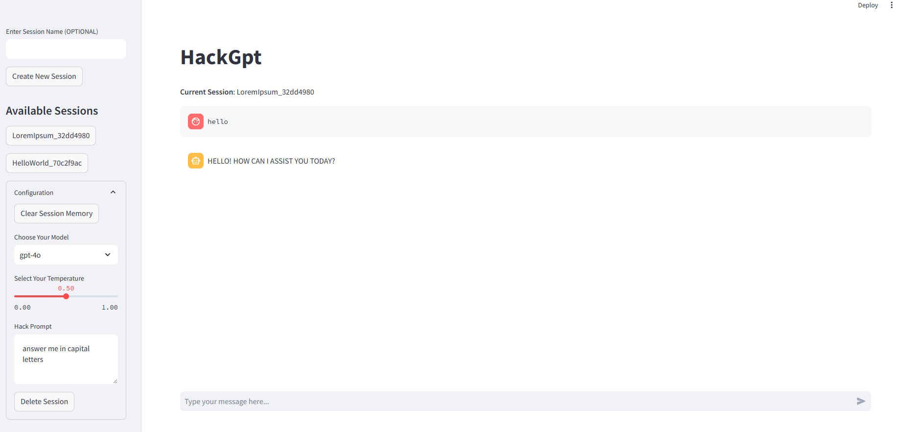

# HackGpt
Simple Chat bot with memory and streamlit interface

# Installation

## Database Setup
Hackgpt supports sqlite and postgres database for storing conversations and history \
A hackgpt_convo.db file will be generated automatically when you run the code so database setup is optional \
In case of error or you want to use your own database change the config as instructed below \
<b>Rename the config-sample.py to config.py</b>
### sqlite
1. create a .db file and add a connection string to SQLITE_URL variable in the config file 
2. set the DB_TYPE variable to "sqlite"
### postgres
1. Install postgres and create a database
2. In the config.py file add the connection string to POSTGRES_URL

## Project Setup 
1. Create a Virtual Environment 
2. Install all the dependencies from the requirements.txt file

    ```
    pip install -r requirements.txt
    ```
3. Add OPENAI_API_KEY in the config.py file
4. Run streamlit interface
   ```
    streamlit run app.py
   ```

## Using Interface
- Create an session by adding a session name(optional) and click "Create New Session" button.

    

- You can change the model for each session and corresponding model temperature. 
- The hack prompt text area allows you to provide extra information that you want your assistant to follow.
- You can clear the current session history using the "Clear Session Memory" button.
- You can delete the current session using the "Delete Session" button

## WIP
- Upload file feature


