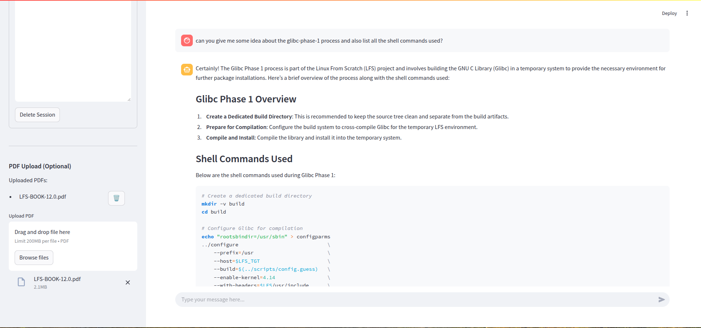
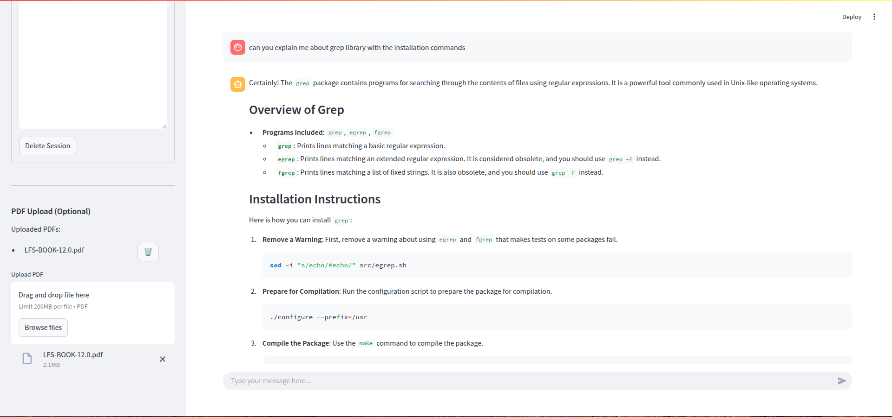

# Example Queries and Responses

This document showcases example interactions with the PDF-based chat system, demonstrating how it handles different types of queries and provides context-aware responses.

## Example 1: Basic Information Query

**User Query:**
```
can you give me some idea about the glibc-phase-1 process and also list all the shell commands used?
```

**System Response:**
```
Certainly! The Glibc Phase 1 process is part of the Linux From Scratch (LFS) project and involves building the GNU C Library (Glibc) in a temporary system to provide the necessary environment for further package installations. Here’s a brief overview of the process along with the shell commands used:

Glibc Phase 1 Overview
Create a Dedicated Build Directory: This is recommended to keep the source tree clean and separate from the build artifacts.
Prepare for Compilation: Configure the build system to cross-compile Glibc for the temporary LFS environment.
Compile and Install: Compile the library and install it into the temporary system.
Shell Commands Used
Below are the shell commands used during Glibc Phase 1:

# Create a dedicated build directory
mkdir -v build
cd build

# Configure Glibc for compilation
echo "rootsbindir=/usr/sbin" > configparms
../configure                             \
    --prefix=/usr                        \
    --host=$LFS_TGT                      \
    --build=$(../scripts/config.guess)   \
    --enable-kernel=4.14                 \
    --with-headers=$LFS/usr/include      \
    libc_cv_slibdir=/usr/lib

# Compile and install Glibc
make
make install

Explanation of Configure Options
--prefix=/usr: Install Glibc into the /usr directory.
--host=$LFS_TGT: Set the target architecture for cross-compilation.
--build=$(../scripts/config.guess): Automatically detect the build architecture.
--enable-kernel=4.14: Enable support for Linux kernel version 4.14 and later.
--with-headers=$LFS/usr/include: Use the kernel headers installed in the temporary system.
libc_cv_slibdir=/usr/lib: Ensure the library is installed in /usr/lib instead of /lib64 on 64-bit systems.
Additional Notes
The configparms file is used to specify that certain utilities should be installed into /usr/sbin.
A warning about missing or incompatible msgfmt might appear, but it is generally harmless.
This process sets up the Glibc library in the temporary LFS environment, allowing you to proceed with building other essential packages.
```



## Example 2: Technical Details Query

**User Query:**
```
can you explain me about grep library with the installation commands
```

**System Response:**
```
Certainly! The grep package contains programs for searching through the contents of files using regular expressions. It is a powerful tool commonly used in Unix-like operating systems.

Overview of Grep
Programs Included: grep, egrep, fgrep
grep: Prints lines matching a basic regular expression.
egrep: Prints lines matching an extended regular expression. It is considered obsolete, and you should use grep -E instead.
fgrep: Prints lines matching a list of fixed strings. It is also obsolete, and you should use grep -F instead.
Installation Instructions
Here is how you can install grep:

Remove a Warning: First, remove a warning about using egrep and fgrep that makes tests on some packages fail.

sed -i "s/echo/#echo/" src/egrep.sh

Prepare for Compilation: Run the configuration script to prepare the package for compilation.

./configure --prefix=/usr

Compile the Package: Use the make command to compile the package.

make

Test the Results: It is a good practice to test the compiled package to ensure everything is working correctly.

make check

Install the Package: Finally, install the package using the make install command.

make install

Build and Installation Information
Approximate Build Time: 0.4 SBU (Standard Build Unit)
Required Disk Space: 39 MB
Dependencies
Installation Depends On: Bash, Binutils, Coreutils, Diffutils, GCC, Gettext, Glibc, Make, Patch, Sed, and Texinfo.
Required at Runtime: Glibc
Test Suite Depends On: Gawk
Optional Dependencies: PCRE2 and libsigsegv
This installation process will set up the grep utility on your system, allowing you to use it for searching text within files using various types of regular expressions.
```

